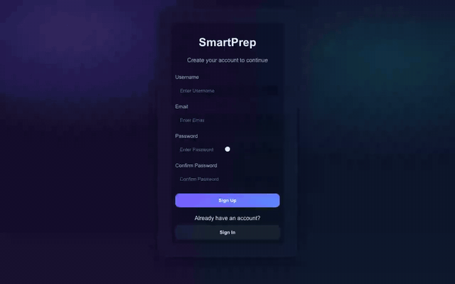
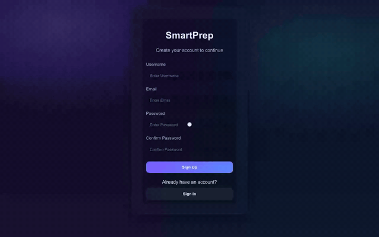
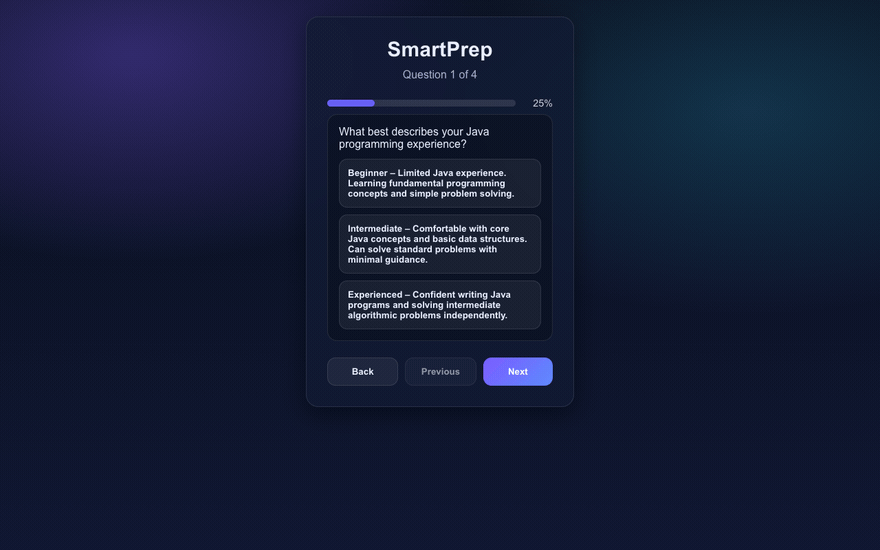
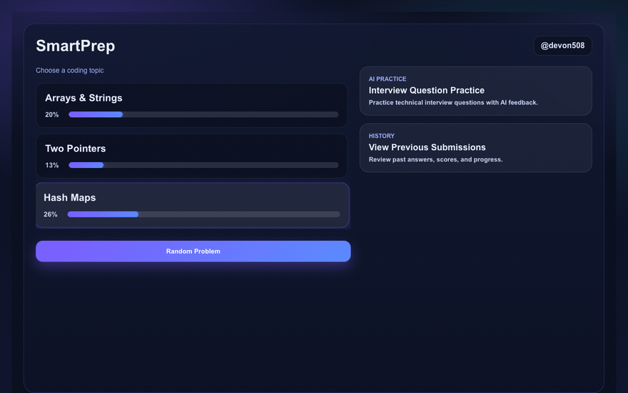
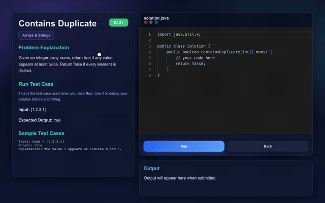
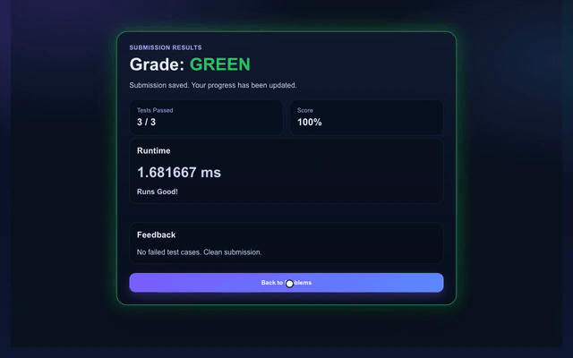
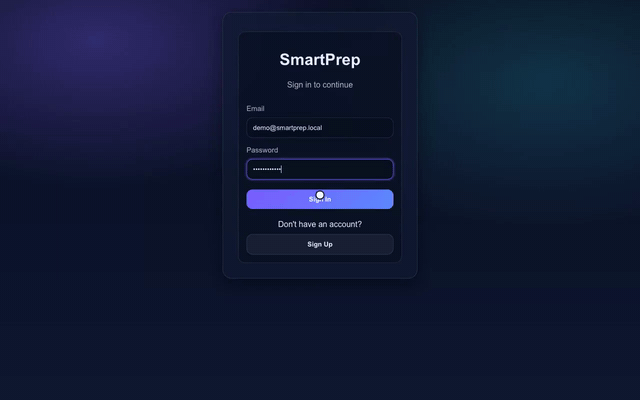

# SmartPrep

**Adaptive coding interview prep.** Rate your own comfort with a topic, and
SmartPrep tracks a proficiency score per topic, serves problems from it, runs
your Java against real test cases on the server, and gives AI feedback on spoken
style interview answers.

React · Spring Boot · MySQL · Monaco Editor · Google Gemini



Every recording below is a real local run against the real backend. Nothing is
mocked.

---

## Sign up and sign in

Account creation with client side validation, and login that reports what went
wrong instead of failing silently.



Shown above: a new account signing up. Signing back in appears further down,
in the history recording.

The password is hashed before storage; the `Users` table holds `pass_hash`, not
the password. Login is `POST /api/v1/users/login`, and the front end surfaces the
server's rejection through a shared error state rather than leaving the form
sitting there.

---

## Proficiency assessment

New accounts answer four short questions, and those answers seed the starting
proficiency for each topic.



This is what makes it adaptive rather than a static problem list. The answers
write `Proficiencies` rows keyed by user and category, which is why two accounts
that answer differently see different starting percentages on the dashboard.
Answer higher and the bars start higher.

---

## Dashboard

Topic progress at a glance, plus entry points to the two practice modes.



Each bar is that user's live proficiency for the category, read from
`GET /api/v1/proficiencies/{userId}/{categoryId}`. Picking a topic pulls a
problem matched to the user through
`GET /api/v1/problem/{userId}/{categoryId}`. **Random Problem** skips the choice,
and **View Previous Submissions** opens every graded coding submission.

---

## Solving a problem

A full editor, a sample test case, and real execution on the server.



The editor is Monaco, the same one that powers VS Code, with Java syntax
highlighting. Each problem ships starter code, its prompt, a sample input and
the expected output.

**Run** (`POST /api/v1/solution/run`) sends the source to the backend, which
compiles it in memory with `javax.tools.JavaCompiler`, invokes the method against
the sample test case, and returns the result. **Submit Final Answer**
(`POST /api/v1/solution`) records the attempt and updates the proficiency that
feeds the dashboard.

Problems span `EASY`, `MEDIUM` and `HARD` across the three categories.

---

## Submission history

Every graded solution is saved, and **View Previous Submissions** lists them
newest first with the problem, the grade, the time and the code you submitted.



Shown above: the submission from the recording before it appears in the
history with its code, then the page is reloaded to the sign-in screen (there is
no logout button yet), the user signs back in, and it is still there. Grading saves the attempt (`POST /api/v1/solution`), and the page reads
`GET /api/v1/solution/submissions?userId=`.

---

## AI interview practice

Written interview questions with model graded feedback, filtered by topic and
difficulty.

Pick a category and a difficulty, get a question, write an answer in your own
words, and submit it for evaluation. This calls
`POST /api/v1/chatbot/evaluate`, which prompts Google Gemini with the question,
the answer and the difficulty, and returns a score plus written feedback.



Shown above: a medium Two Pointers question, a typed answer, a 99/100 score with
feedback, and the topic's progress going up on the dashboard.

> Requires a `GEMINI_API_KEY`. Without one, the rest of the application works and
> only this screen fails.

---

## Architecture

```
  React 19 (3000)  ──HTTP──►  Spring Boot 3.5 (8080)  ──JPA / Hibernate──►  MySQL 8
      Monaco                        │
                                    ├─► javax.tools.JavaCompiler   run a solution
                                    └─► Google Gemini              grade an answer
```

| Endpoint | Purpose |
|---|---|
| `POST /api/v1/users` | create an account |
| `POST /api/v1/users/login` | authenticate |
| `GET /api/v1/proficiencies/{userId}/{categoryId}` | dashboard progress bars |
| `GET /api/v1/problem/{userId}/{categoryId}` | select a problem for this user |
| `POST /api/v1/solution/run` | compile and run against the sample test case |
| `POST /api/v1/solution` | submit, record, update proficiency |
| `POST /api/v1/chatbot/evaluate` | grade a written interview answer |

Six tables: `Users`, `Categories`, `Problems`, `Test_Cases`, `Submissions`,
`Proficiencies`. Full DDL in [`src/main/resources/db/schema.sql`](src/main/resources/db/schema.sql).

---

## Running it locally

### Requirements

- **A full JDK 17+**, not a JRE. Submitted solutions are compiled at runtime.
- MySQL 8.0+
- Node.js and npm
- A Google Gemini API key, for the AI practice screen only

### 1. Database

```bash
mysql -u root -e "CREATE DATABASE smartprep;"
mysql -u root smartprep < src/main/resources/db/schema.sql
mysql -u root smartprep < src/main/resources/db/seed.sql
```

The seed provides three categories and eight problems across all three
difficulties, with their test cases. Users and proficiency rows are created by
the signup flow, so they are not seeded.

For an existing database, run `ALTER TABLE Submissions MODIFY answer TEXT;`.

### 2. Backend

```bash
DB_URL=jdbc:mysql://localhost:3306/smartprep \
DB_USERNAME=youruser \
DB_PASSWORD=yourpassword \
GEMINI_API_KEY=yourkey \
./mvnw spring-boot:run
```

Port 8080.

### 3. Frontend

```bash
cd frontend
npm install
npm start
```

Port 3000.

**Both ports matter.** The front end calls `http://localhost:8080` directly and
the controllers are annotated `@CrossOrigin(origins = "http://localhost:3000")`.
Change one and you must change the other, or the browser blocks every request.

---

## About this project

SmartPrep started as a three-person capstone project, and this repository
continues from the team's final version.

**What I built:**

- **The AI feedback subsystem**, end to end: `ChatbotService`,
  `ChatbotServiceImpl`, `ChatbotController`, the request and response DTOs, and
  the `ChatbotPage` React component with its styling.
- **The JPA domain model**: the `Problem`, `Submission`, `Proficiency`,
  `Category`, `User` and `TestCase` entities, plus the `ProblemDifficulty` and
  `SolutionRating` enums. These are the six tables above.
- **After the class:** the database schema and seed so it runs from a clean
  clone, `TEXT` columns for problem content (starter code used to get cut at 255
  characters and squashed onto one line), and the coding submission history.

The rest is my teammates' work.
